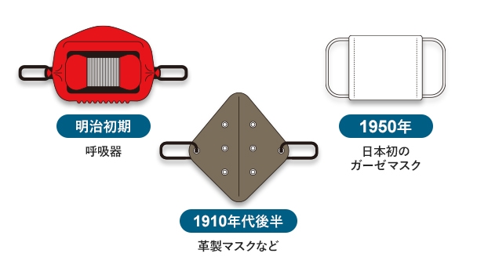
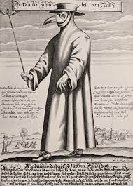

---
Keywords:
Copyright: (c) 2022 Teppei Inamura
---
# マスクの歴史

## ・日本の歴史

日本でのマスクの始まりは明治初期だったと言われている。当時のマスクは銅と亜鉛で出来た金属の金網を芯にして、布地をフィルターとして取り付けたものだった。炭鉱などで働く人たちが主につけていたため「工場マスク」と言われていた。

しかし、1918年にインフルエンザが大流行しマスクが予防品として注目を浴び広まりました。このインフルエンザに2400万人が感染し、そのうちの40万人が死亡したと言われています。これ以降インフルエンザが流行るたびにマスクの生産を増やし、マスクを改良し始めました。そして1950年頃には日本初の布製（ガーゼ）マスクが誕生し、さらに1973年に不織布マスクが生産販売されました。1980年以降、爆発的に増えた花粉症やインフルエンザの対策として一般家庭にマスクの普及を促進するようになり現在に至っています。

## ・世界の歴史

マスクの起源はおよそ1世紀まで遡ります。古代ローマの博物学者ガイウス・プリニウス・セクンドゥスの著書には、動物の体の一部を使ったマスクが紹介されてる。布製（ガーゼ）マスクの起源は16世紀にレオナルド・ダ・ヴィンチが発明されたと言われている。レオナルド・ダ・ヴィンチが発明したマスクは布を水に濡らして使うため主に船乗りの人向けに作られたものだった。

17世紀になり、アニメや漫画で目にする鳥のくちばしのようなマスク「ペストマスク」が誕生し。主に医者の人たちが身に着けて人々を治療していました。ペストマスクの先端に薬草や香草を入れ臭いにおいから守る構造になっています。

そして時が流れ、1918年インフルエンザ流行時にアメリカでマスクが広まるようになり、2003年には香港でマスクが日用品として認知されるようになりました。日本を含め世界中でマスクが一般化されるようになったのは長い歴史から見ればごく最近のことだったのです。マスクの起源はおよそ1世紀まで遡ります。古代ローマの博物学者ガイウス・プリニウス・セクンドゥスの著書には、動物の体の一部を使ったマスクが紹介されてる。布製（ガーゼ）マスクの起源は16世紀にレオナルド・ダ・ヴィンチが発明されたと言われている。レオナルド・ダ・ヴィンチが発明したマスクは布を水に濡らして使うため主に船乗りの人向けに作られたものだった。

17世紀になり、アニメや漫画で目にする鳥のくちばしのようなマスク「ペストマスク」が誕生し。主に医者の人たちが身に着けて人々を治療していました。ペストマスクの先端に薬草や香草を入れ臭いにおいから守る構造になっています。

そして時が流れ、1918年インフルエンザ流行時にアメリカでマスクが広まるようになり、2003年には香港でマスクが日用品として認知されるようになりました。日本を含め世界中でマスクが一般化されるようになったのは長い歴史から見ればごく最近のことだったのです。

