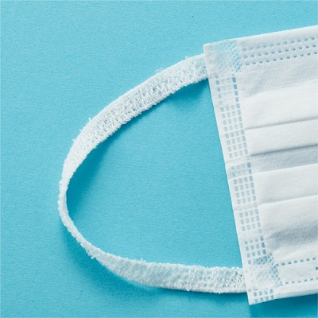
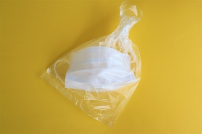

# 正しい捨て方

ここではマスクの捨て方、方法について説明します。マスクの捨て方が悪いと捨てる時に自分の手や服にウイルスが付き、ウイルスをまき散らかしてしまう可能性やマスクを捨てたごみ袋を回収しに来たごみ収集の方にウイルスが付着し感染してしまう事が起きます。実際にごみ収集の方が感染してしまった事例がいくつかあるので今一度捨て方、方法を知っておきましょう！

#### 方法その1　マスクを外す時は内側、外側を触れてはいけない！

マスクの内側、外側の表面にはいろいろな細菌・ウイルスが付着しているのでとても危険です。なので表面には触れずに、マスクの耳紐の部分を持ち外しましょう。

#### 方法その2　マスクを捨てる時は折りたたまない！

きれい好きやしっかりしている人は特にですがごみをなるべく小さくして少しでもかさばらないように捨てる人がいると思います。普通のごみはその捨て方がとても良いですが、マスクは良くありません。方法その1で説明しましたがマスクの表面には沢山のウイルスが付着しています。マスクを小さく折りたたむということは表面を触れることになるので小さく折りたたむことはやめましょう。

#### 方法その3　マスクを小さい袋に入れ袋の口しっかりを閉じる！

マスクを捨てる時はマスク本体も小さい袋に入れ、しっかり口を閉じて捨てることが大事です。そうすることによって風やごみの飛び出しなどでウイルスが外に漏れるということを防ぐことができます。口の閉じ方は方結び、一本結びをおすすめします。

