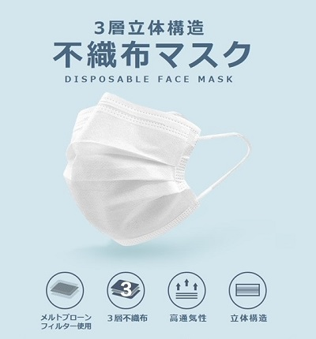

# 不織布マスク

ここでは不織布マスクについて説明します。不織布マスクは家庭用マスクの一つですが、医療用のマスクでもあります。この不織布マスクには3つの良い点があるので説明していきます。

■飛沫抑制効果が高い

他の素材のマスクに比べて不織布マスクは飛沫の飛散を抑える効果が高く、家庭用マスクとして最高レベルの飛沫の飛散抑制効果があります。そのため満員電車内、人の多い商業施設、病院などの場所に適しています。

■使い捨てのため衛生的

布マスクと違って何回も繰り返して使うことはできず基本的には使い捨てになりますが、一回使用してすぐ捨てるので衛生的にとても良いです。なので医療や介護の現場でも良く使われています。

■かさばらず携帯に便利

不織布マスクは生地が薄く、かさばらないので携帯して持ち歩くことができ便利です。最近ではマスクを入れ保存する、携帯するためのケースが販売されているのでそれを利用することをおすすめします。

